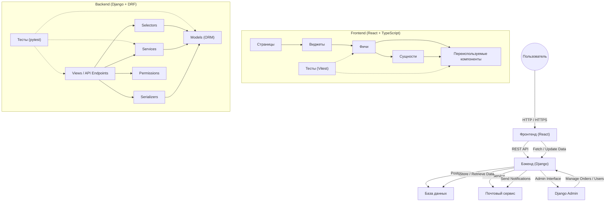

# 🏛️ Архитектура проекта

Этот документ описывает высокоуровневую архитектуру проекта `icambio`, взаимодействие его основных компонентов и принятые технологические решения.

---

## 1. Обзор архитектуры

Проект `icambio` представляет собой монорепозиторий, состоящий из двух основных частей: **Бэкенд** (на Django) и **Фронтенд** (на React).

---

## 2. Ключевые компоненты и их взаимодействие

### 2.1. Бэкенд (Django Rest Framework)

Разработан на Python с использованием фреймворка Django и Django Rest Framework (DRF) для построения REST API.

-   **Django Apps:** Проект разделён на модульные приложения, каждое из которых отвечает за определённую бизнес-сущность или функциональную область:
    -   `users`: Управление пользователями, их профилями, аутентификацией.
    -   `exchange`: Управление валютами, курсами обмена, обменными пунктами и их балансами.
    -   `orders`: Управление заявками на обмен, элементами заказов, документами и отзывами.
-   **Структура приложения:** Каждое приложение придерживается принципа разделения логики:
    -   `models.py`: Определяет модели данных и бизнес-сущности.
    -   `serializers.py`: Отвечает за преобразование данных (Python объекты <-> JSON) и валидацию.
    -   `views.py`: Содержит логику обработки HTTP-запросов и ответов, вызывая сервисы и селекторы для бизнес-логики.
    -   `services.py` (рекомендовано): Для вынесения сложной бизнес-логики из `views`.
    -   `selectors.py` (рекомендовано): Для инкапсуляции сложных запросов к БД.
    -   `permissions.py`: Определяет логику доступа к ресурсам.

### 2.2. Фронтенд (React + TypeScript)

Разработан на React с использованием TypeScript и сборщика Vite.

-   **Структура директорий (Feature-Sliced Design):** Используется адаптированная методология для организации кода:
    -   `src/app`: Инициализация приложения (роутер, стор, провайдеры).
    -   `src/pages`: Компоненты страниц, композирующие фичи и виджеты.
    -   `src/widgets`: Самостоятельные блоки UI, состоящие из фич и сущностей.
    -   `src/features`: Реализация бизнес-сценариев пользователя (например, `auth`, `exchange`, `profile`). Каждая фича имеет свою внутреннюю структуру (`components`, `hooks`, `services`, `store`, `types`, `tests`, `constants`).
    -   `src/entities`: Компоненты и логика для работы с бизнес-сущностями (`User`, `Order`, `Currency`).
    -   `src/shared`: Переиспользуемый код (UI-кит, вспомогательные функции, конфигурация).
-   **Управление состоянием:**
    -   **React Query (`@tanstack/react-query`):** Основной инструмент для работы с состоянием сервера (данные с API, кеширование, инвалидация, фоновое обновление).
    -   **Zustand:** Используется для глобального клиентского состояния (например, информация об аутентификации, состояние UI, данные форм).
    -   **Локальное состояние (`useState`, `useReducer`):** Для состояния, специфичного для отдельного компонента (например, состояние инпутов).
-   **Взаимодействие с API:** Используется `Axios` через единый инстанс с перехватчиками (интерсепторами) для автоматического добавления заголовка `Authorization` и обработки общих ошибок.

---

## 3. Аутентификация

Процесс аутентификации полностью управляется Supabase, Django лишь валидирует JWT.

1.  **Регистрация/Логин:** Фронтенд взаимодействует напрямую с Supabase для аутентификации пользователя.
2.  **Получение токенов:** Supabase возвращает JWT (JSON Web Token).
3.  **Хранение токенов:** Фронтенд сохраняет полученный токен (обычно в `localStorage` или `sessionStorage`).
4.  **Доступ к защищенным ресурсам:** При каждом запросе к защищенным эндпоинтам фронтенд прикрепляет JWT токен в заголовке `Authorization: Bearer <token>`.
5.  **Валидация токенов:** Бэкенд (Django) валидирует полученный JWT токен, подтверждая его подлинность и срок действия. Если токен недействителен, возвращается ошибка.
6.  **Обновление токенов:** Обновление токенов происходит на стороне Supabase, либо при необходимости фронтенд может запросить новый токен после истечения срока действия предыдущего.

---

## 4. База данных

В процессе разработки используется **SQLite** (`db.sqlite3`).

Для production-окружения предполагается использование **PostgreSQL** (например, через **Supabase**), что обеспечит надёжность и масштабируемость.

---

## 5. Инструменты и сторонние сервисы

-   **Supabase:** Используется как внешняя база данных (PostgreSQL) и для аутентификации пользователей.
-   **Django Admin:** Встроенный административный интерфейс Django для управления данными (заявки, пользователи, курсы валют).
-   **Email Service:** Используется для отправки уведомлений (например, сброс пароля, активация аккаунта).

---

## 6. Целевая архитектура развертывания и DevOps (постепенная реализация)

-   **Контейнеризация:** Docker
-   **Кэширование:** Redis
-   **Асинхронные задачи:** Redis / Celery
-   **CI/CD:** GitLab CI / Jenkins
-   **Мониторинг:** Prometheus + Grafana 

## Frontend

### 1. Структура директорий (Feature-Sliced Design)

Проект использует адаптированную версию методологии Feature-Sliced Design.

- **`src/app`**: Инициализация приложения (роутер, стор, провайдеры). (В текущей структуре это `main.tsx` и `App.tsx`)
- **`src/pages`**: Страницы приложения. Каждая страница — это компонент, который композирует в себе различные "фичи" и "виджеты".
- **`src/widgets`**: Самостоятельные блоки UI, состоящие из нескольких "фич" и "сущностей". Пример: шапка сайта (`Header`), подвал (`Footer`), панель навигации.
- **`src/features`**: Бизнес-сценарии пользователя. Каждая фича решает одну задачу. Например: `auth` (аутентификация), `exchange` (создание заявки на обмен).
    - Структура фичи: `components`, `hooks`, `services`, `store`, `types`, `tests`, `constants`.
- **`src/entities`**: Бизнес-сущности. Например: `User`, `Order`, `Currency`. Этот слой содержит компоненты для отображения сущностей, хуки и сторы для работы с ними. (Сейчас частично реализовано внутри `features`).
- **`src/shared`**: Переиспользуемый код, не имеющий отношения к бизнес-логике.
    - `ui`: UI-кит (кнопки, инпуты, модальные окна).
    - `lib`: Вспомогательные функции и хуки (например, `logger`).
    - `config`: Конфигурация приложения (роуты, переменные окружения).
    - `api`: Настройка инстанса `axios`, базовые типы для API.

### 2. Управление состоянием

- **React Query (`@tanstack/react-query`)**:
    - **Назначение**: Основной инструмент для работы с состоянием сервера (Server State). Используется для всех CRUD-операций с API (получение, создание, обновление, удаление данных).
    - **Кеширование**: Управляет кешированием, инвалидацией и фоновым обновлением данных.
    - **Обязательно**: Все асинхронные запросы к бэкенду должны быть обернуты в хуки React Query (`useQuery`, `useMutation`).

- **Zustand**:
    - **Назначение**: Управление глобальным состоянием клиента (Client State), которое не связано с сервером или которое нужно разделять между множеством несвязанных компонентов.
    - **Примеры**:
        - Состояние аутентификации пользователя (токен, информация о пользователе, статус `isAuth`).
        - Состояние UI (открыта ли модалка, какая тема выбрана).
        - Данные, которые вводятся в многошаговых формах.
    - **Не использовать для**: Хранения данных, полученных с сервера. Для этого есть React Query.

- **Локальное состояние (`useState`, `useReducer`)**:
    - **Назначение**: Управление состоянием, которое относится только к одному компоненту и не требуется за его пределами.
    - **Примеры**: Состояние инпутов в форме, состояние открыт/закрыт для выпадающего списка.

### 3. Взаимодействие с API

- **Axios**: Используется для выполнения HTTP-запросов. Создается единый инстанс `axios` в `src/shared/api/api.ts`.
- **Перехватчики (Interceptors)**:
    - **Request Interceptor**: Автоматически добавляет `Authorization` заголовок (JWT токен из Zustand) ко всем исходящим запросам.
    - **Response Interceptor**: Обрабатывает типичные ошибки (например, 401 Unauthorized для разлогина пользователя) в одном месте.
- **Типизация и Валидация**:
    - **Zod**: Используется для валидации как форм на клиенте, так и ответов от API. Это гарантирует, что данные соответствуют типам TypeScript.

### 4. Тестирование

Проект придерживается прагматичного подхода к тестированию, нацеленного на проверку критически важной логики.

- **Инструменты**: `Vitest` для запуска тестов, `React Testing Library` для рендеринга и взаимодействия с компонентами.
- **Что тестируем**:
  - **Unit-тесты**: Валидационные схемы Zod, сложные хуки, сервисные функции.
  - **Интеграционные тесты**: Ключевые пользовательские сценарии (например, процесс входа, создание заявки на обмен).
- **Расположение**: Тесты находятся в папке `tests` внутри каждой фичи (например, `src/features/auth/tests`).
- **Запуск**: `yarn test` для запуска всех тестов, `yarn test:ui` для интерактивного режима.

---

## Backend

### 1. Аутентификация (Supabase JWT)

Процесс аутентификации **полностью** управляется Supabase. Django-бэкенд не генерирует и не хранит токены, а только валидирует их.

1.  **Логин/Регистрация**: Фронтенд взаимодействует напрямую с **Supabase** для аутентификации пользователя.
2.  **Получение токена**: В случае успеха Supabase возвращает JWT (JSON Web Token).
3.  **Взаимодействие с бэкендом**: Фронтенд сохраняет этот токен в `localStorage` (через `Zustand`) и прикрепляет его в виде `Authorization: Bearer <token>` ко всем запросам на наш Django-бэкенд.
4.  **Валидация на бэкенде**: Django-бэкенд на каждом защищенном эндпоинте:
    -   Использует кастомный класс `SupabaseJWTAuthentication`.
    -   Проверяет подпись и срок действия JWT с помощью секрета `SUPABASE_JWT_SECRET`.
    -   Если токен валиден, извлекает `supabase_user_id`.
    -   Использует `get_or_create` для получения или создания локального пользователя Django (`models.User`), связывая его с `supabase_user_id`.
    -   Таким образом, сессия на бэкенде является полностью **stateless**.

### 2. Django Apps

- **Принцип единственной ответственности**: Каждое Django-приложение (`app`) должно отвечать за одну четкую бизнес-сущность или функциональную область.
    - `users`: Управление профилями пользователей. Аутентификация вынесена на уровень Middleware/Authentication Classes.
    - `orders`: Управление заявками на обмен.
    - `exchange`: Управление валютами, курсами, направлениями обмена.
- **Разделение логики**:
    - **`views.py`**: Содержат только логику, связанную с обработкой HTTP-запросов и ответов. Они принимают запрос, вызывают сервисы для выполнения бизнес-логики и возвращают ответ, используя сериализаторы.
    - **`serializers.py`**: Отвечают за преобразование данных (Python objects <-> JSON) и валидацию входящих данных.
    - **`services.py` (рекомендуется)**: Для вынесения сложной бизнес-логики из `views`.
    - **`selectors.py` (рекомендуется)**: Для сложных запросов к БД (`QuerySet`).

### 3. Тестирование

Проект использует прагматичный подход к тестированию, фокусируясь на критически важной бизнес-логике.

- **Инструменты**: `pytest` с плагином `pytest-django` для интеграции с Django, `factory-boy` для создания тестовых данных.
- **Что тестируем**:
  - **Unit-тесты**: Модели Django, сервисные функции, селекторы, валидация сериализаторов.
  - **Интеграционные тесты**: API эндпоинты, аутентификация, полные пользовательские сценарии.
  - **Тесты аутентификации**: Валидация JWT токенов Supabase, создание пользователей, права доступа.
- **Структура**: Тесты находятся в папке `backend/tests/` с разделением по приложениям (`test_users.py`, `test_orders.py`, `test_exchange.py`).
- **Конфигурация**: `pytest.ini` настроен на покрытие кода с минимальным порогом 80%, генерацию HTML-отчетов.
- **Запуск**: `pytest` для всех тестов, `pytest --cov` для отчета о покрытии, `pytest -m unit` для только unit-тестов. 